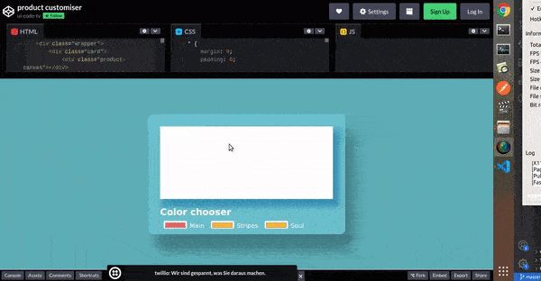
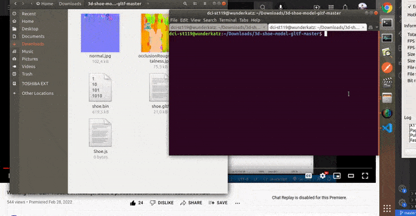
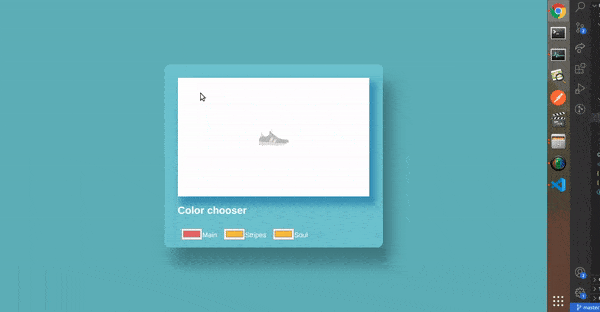
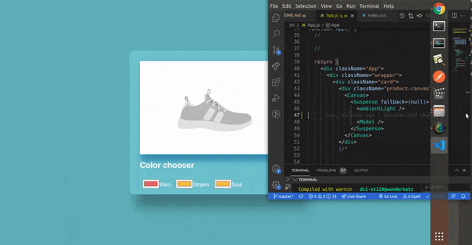
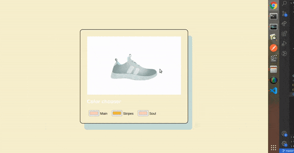

### Product Configurator with react-three-fiber

<br>

> Product configuration is the process of customizing a product to meet the needs of a customer. A product configuration tool is usually included as a part of CPQ software and allows customers and sales reps to configure products themselves.

<br>
<br>

#### articles

[Building a 3D Product Configurator with Nuxt and Three.js (Part 1)](https://official-osorina.medium.com/creating-a-3d-configurator-with-nuxt-and-three-js-part-1-6d40da0209e0)

<br>

#### video examples

[3D model configurator with React Three Fiber and gltfjsx](https://www.youtube.com/watch?v=xy_tbV4pC54)

[Working with GLTF models in React.js: Build a product customizer with react-three-fiber](https://www.youtube.com/watch?v=2jwqotdQmdQ&list=PLIQopnnM5nVatnVa0YZZFGG1EDaSpJ2tn&index=480)

<br>
<br>

---

<br>
<br>

# 🐖

## Before start!!!

> Read the documentation and install the dependencies 🌞

<br>

#### React three fiber

##### [documentation](https://docs.pmnd.rs/react-three-fiber/getting-started/examples)

<br>

#### Models

##### Get some models here:

- low poly [poly.pizza](https://poly.pizza/search/shoe)

- [cgtrader](https://www.cgtrader.com/3d-models?keywords=zapatilla)

<br>

#### Installation

```javascript
npm i three @react-three/fiber @react-three/drei
```

##### What is react three Drei?

> A growing collection of useful helpers and fully functional, ready-made abstractions for react-three-fiber. If you make a component that is generic enough to be useful to others, think about making it available here through a PR! npm install @react-three/drei.

<br>

##### [@react Three/drei Examples](https://codesandbox.io/examples/package/@react-three/drei)

<br>
<br>

### What we will be doing in this tutorial:

<br>

- How to use React.js with react-three-fiber to render and manipulate 3d models

- How to interactively change properties of the 3d model

- How to work with **GLTF** file formats in React

<br>
<br>

---

<br>
<br>

# 🌈

## Lets Begin!!!

<br>

#### Import the dependencies we will be using to create the project:

<br>

```javascript
import { useRef, useState } from "react";
//
// the canvas is our scene
import { Canvas } from "@react-three/fiber";
//
// The Orbits controls will help us to rotate the model in a tridimensional way
import { OrbitControls, useGLTF } from "@react-three/drei";
// the useGLTF, will help us to load the model in the gltf format.
```

<br>
<br>

# 🎨

### The Canvas

> **Like in painting, the canvas** is the thing where you add all the stuff you want your scene to contain, a painter will add threes, flowers, clouds etc inside the canvas, but before we can use the canvas we have to choose the size of our canvas, do we want it large or really wide?...

<br>

- Start by adding the **canvas**, then inside the canvas add a geometry.

<br>

- To this geometry you will add some values **height, width, depth** in other words the **x,y,z** axis.

```javascript
// args: arguments
args={[2,2,2]}
```

<br>

#### Inside the canvas we will tell it that we will like to start with a mesh, the sort of mesh we want is a box, so in this case it's a boxGeometry, you can also add plane geometry etc

<br>

> **A Mesh** is a basic scene object in three.js, and it's used to hold the geometry and the material needed to represent a shape in 3D space. We'll create a new mesh using a BoxGeometry and a MeshStandardMaterial which automatically attach to their parent. [Adding a Mesh Component](https://docs.pmnd.rs/react-three-fiber/getting-started/your-first-scene)

<br>

#### 🌞 For testing purposes

- For testing purposes we will add the following, later on we will replace it with what we will actually use to interact with the model.

<br>

```javascript
function App() {
  const ref = useRef();
  //
  return (
    <div className="App">
      <Canvas>
        <mesh ref={ref}>
          <boxGeometry attach="geometry" args={[4, 4, 4]} />
        </mesh>
      </Canvas>
    </div>
  );
}

export default App;
```

<br>

### Add also this to the css, to center the box

```css
.App {
  width: 100vw;
  height: 100vh;
  display: flex;
  justify-content: center;
  align-items: center;
}
```

<br>

#### With this setup you will have a square in the middle, now that we know that its working we will replace this setup with what have here below.

<br>
<br>

### THE BOX (color picker)

#### replace the previous setup with this:

#### [product customiser](https://codepen.io/ui-code-tv/pen/PoOezaw)

<br>

##### Here we will set up a box that will contain few options to choose a color, you will understand this later

<br>

```html
<div class="wrapper">
  <div class="card">
    <!-- CANVAS  -->
    <div class="product-canvas"></div>
    <h2>Color chooser</h2>

    <!-- 


     COLOR PICKER

    
    -->
    <div class="colors">
      <div>
        <input type="color" id="head" name="head" value="#e66465" />
        <label for="head">Main</label>
      </div>

      <div>
        <input type="color" id="body" name="body" value="#f6b73c" />
        <label for="body">Stripes</label>
      </div>
      <div>
        <input type="color" id="body" name="body" value="#f6b73c" />
        <label for="body">Soul</label>
      </div>
    </div>
  </div>
</div>
```

<br>

[](https://codepen.io/ui-code-tv/pen/PoOezaw)

<br>

#### Styles

```css
.wrapper {
  min-height: 100vh;
  display: flex;
  align-items: center;
  justify-content: space-around;
  background-color: #5dafb8;
  color: white;
  font-family: Verdana, Geneva, Tahoma, sans-serif;
}

.card {
  height: 50vh;
  border-radius: 13px;
  box-shadow: 20px 40px 33px rgba(0, 0, 0, 0.3);
  padding: 2rem;
  width: 35vw;
  background-color: #6cc2ce;
}

.product-canvas {
  width: 35vw;
  height: 38vh;
  background: white;
  box-shadow: 10px 15px 15px 6px #3891b4;
  border-radius: 0px;
  margin-bottom: 20px;
}

.colors {
  display: flex;
  flex-direction: row;
}

.colors div {
  padding: 8px;
}
```

<br>
<br>

#### This is what you should have in your code

```javascript
import { useRef, useState } from "react";
//
// the canvas is our scene
import { Canvas } from "@react-three/fiber";
//
// The Orbits controls will help us to rotate the model in a tridimensional way
import { OrbitControls, useGLTF } from "@react-three/drei";
// the useGLTF, will help us to load the model in the gltf format.

function App() {
  //

  const ref = useRef();
  //

  return (
    <div className="App">
      {/* <Canvas>
        <mesh ref={ref}>
          <boxGeometry attach="geometry" args={[4, 4, 4]} />
        </mesh>
      </Canvas> */}

      <div class="wrapper">
        <div class="card">
          <div class="product-canvas"></div>
          <h2>Color chooser</h2>

          <div class="colors">
            <div>
              <input type="color" id="head" name="head" value="#e66465" />
              <label for="head">Main</label>
            </div>

            <div>
              <input type="color" id="body" name="body" value="#f6b73c" />
              <label for="body">Stripes</label>
            </div>
            <div>
              <input type="color" id="body" name="body" value="#f6b73c" />
              <label for="body">Soul</label>
            </div>
          </div>
        </div>
      </div>
    </div>
  );
}

export default App;
```

<br>

#### The outcome is exactly what we have on the img

[](https://codepen.io/ui-code-tv/pen/PoOezaw)

<br>
<br>

---

<br>
<br>

## The 3D MODEL

- [Go to this](https://github.com/ui-code-tv/3d-shoe-model-gltf) git repository and download the 5 files

- Once you have them, put the 5 files inside the **public folder** of your project

#### Since you also saved a copy of the zip downloaded from github containing the shoe files, we will do the following:

<br>

- INside the **downloads folder** of your computer, extract the zip containing the 5 files, once decompressed, look for the **shoe.js**, right click on it and choose to **open in a text editor** , there you will find the following data related to the shoe, **this is important, as it will serve to modify each part of the shoe**

<br>

[]()

<br>

#### 🔴 If your zip didnt came with a shoe.js ,type the following command like you see it on the gif above

```javascript
npx gltfjsx shoe.gltf
```

<br>

#### Now grab the data from the file

<br>

```javascript
/*
Auto-generated by: https://github.com/pmndrs/gltfjsx
*/

import React, { useRef } from "react";
import { useGLTF } from "@react-three/drei";

export default function Model({ ...props }) {
  const group = useRef();
  const { nodes, materials } = useGLTF("/shoe.gltf");
  return (
    <group ref={group} {...props} dispose={null}>
      <mesh geometry={nodes.shoe.geometry} material={materials.laces} />
      <mesh geometry={nodes.shoe_1.geometry} material={materials.mesh} />
      <mesh geometry={nodes.shoe_2.geometry} material={materials.caps} />
      <mesh geometry={nodes.shoe_3.geometry} material={materials.inner} />
      <mesh geometry={nodes.shoe_4.geometry} material={materials.sole} />
      <mesh geometry={nodes.shoe_5.geometry} material={materials.stripes} />
      <mesh geometry={nodes.shoe_6.geometry} material={materials.band} />
      <mesh geometry={nodes.shoe_7.geometry} material={materials.patch} />
    </group>
  );
}

useGLTF.preload("/shoe.gltf");
```

<br>

#### As you can see, we already have the top of this code in our code, now we will see what and how we will be implementing it.

- we will be taking this code and placing it **on top of our app function** like so:

> As you can notice, I removed the **export default**

```javascript


function Model({ ...props }) {
  const group = useRef();
  const { nodes, materials } = useGLTF("/shoe.gltf");
  return (
    <group ref={group} {...props} dispose={null}>
    //
        //👍the following below access each individual part of the model

        //
      <mesh geometry={nodes.shoe.geometry} material={materials.laces} />
      <mesh geometry={nodes.shoe_1.geometry} material={materials.mesh} />
      <mesh geometry={nodes.shoe_2.geometry} material={materials.caps} />
      <mesh geometry={nodes.shoe_3.geometry} material={materials.inner} />
      <mesh geometry={nodes.shoe_4.geometry} material={materials.sole} />
      <mesh geometry={nodes.shoe_5.geometry} material={materials.stripes} />
      <mesh geometry={nodes.shoe_6.geometry} material={materials.band} />
      <mesh geometry={nodes.shoe_7.geometry} material={materials.patch} />
    </group>
  );
}

function App() {
  //

```

<br>
<br>

# 🥭

### Now lets render the model

<br>

- You will be adding the model in a **suspense**. 🔴 What the suspense will do here, is to catch for errors in case there is an issue with the model, loading etc

<br>

```javascript
  return (
    <div className="App">
      <div className="wrapper">
        <div className="card">
          <div className="product-canvas">
            <Canvas>


<Suspense>

👍

</Suspense>

            </Canvas>
          </div>
          {/*


          */}
          <h2>Color chooser</h2>
```

<br>
<br>

### Adding the model to the scene

- we will also add a spinner to the suspense but it will be set as **null**

```javascript
<Suspense fallback={null}></Suspense>
```

<br>

### add an ambient light and then the model

- As you can notice, the model is coming from the function above the App function.

```javascript
<Canvas>
  <Suspense fallback={null}>
    <ambientLight />
    <Model />
  </Suspense>
</Canvas>
```

[]()

<br>

```javascript
import { Suspense, useRef, useState } from "react";
//
// the canvas is our scene
import { Canvas } from "@react-three/fiber";
//
// The Orbits controls will help us to rotate the model in a tridimensional way
import { OrbitControls, useGLTF } from "@react-three/drei";
// the useGLTF, will help us to load the model in the gltf format.

/*


*/

function Model({ ...props }) {
  const group = useRef();
  const { nodes, materials } = useGLTF("/shoe.gltf");
  return (
    <group ref={group} {...props} dispose={null}>
      <mesh geometry={nodes.shoe.geometry} material={materials.laces} />
      <mesh geometry={nodes.shoe_1.geometry} material={materials.mesh} />
      <mesh geometry={nodes.shoe_2.geometry} material={materials.caps} />
      <mesh geometry={nodes.shoe_3.geometry} material={materials.inner} />
      <mesh geometry={nodes.shoe_4.geometry} material={materials.sole} />
      <mesh geometry={nodes.shoe_5.geometry} material={materials.stripes} />
      <mesh geometry={nodes.shoe_6.geometry} material={materials.band} />
      <mesh geometry={nodes.shoe_7.geometry} material={materials.patch} />
    </group>
  );
}

function App() {
  //
  //

  return (
    <div className="App">
      <div className="wrapper">
        <div className="card">
          <div className="product-canvas">
            // ✋ the model
            <Canvas>
              <Suspense fallback={null}>
                <ambientLight />
                <Model />
              </Suspense>
            </Canvas>
          </div>
          {/* 
          
          
          */}
          <h2>Color chooser</h2>

          <div className="colors">
            <div>
              <input type="color" id="head" name="head" value="#e66465" />
              <label for="head">Main</label>
            </div>

            <div>
              <input type="color" id="body" name="body" value="#f6b73c" />
              <label for="body">Stripes</label>
            </div>
            <div>
              <input type="color" id="body" name="body" value="#f6b73c" />
              <label for="body">Soul</label>
            </div>
          </div>
        </div>
      </div>
    </div>
  );
}

export default App;
```

<br>
<br>

## Scale the shoe

```javascript
function Model({ ...props }) {
  const group = useRef();
  const { nodes, materials } = useGLTF("/shoe.gltf");
  return (
    <group ref={group} {...props} dispose={null} scale={3} ✋>
```

### As you can see the shoes is missing some light, lets add it

```javascript
<Canvas>
  <Suspense fallback={null}>
    <ambientLight />
    <spotLight
      intensity={0.9}
      angle={0.1}
      penumbra={1}
      position={[10, 15, 10]}
      castShadow
    />
    <Model />
  </Suspense>
</Canvas>
```

[]()

<br>
<br>

# Orbitscontrol

- To be able to rotate the model and also zoom, we will be using the orbits control

<br>

> **What is panning?** In cinematography and photography panning means swivelling a still or video camera horizontally from a fixed position.

[Panning (camera)](<https://en.wikipedia.org/wiki/Panning_(camera)>)

<br>

```javascript
<Canvas>
  <Suspense fallback={null}>
    <ambientLight />
    <spotLight
      intensity={0.9}
      angle={0.1}
      penumbra={1}
      position={[10, 15, 10]}
      castShadow
    />
    <Model />
    ✋
    <OrbitControls enablePan={true} enableZoom={true} enableRotate={true} />✋
  </Suspense>
</Canvas>
```

<br>
<br>

---

<br>
<br>

# 🌈

### Adding attributes to each part of the model

<br>

- We will add attributes to all the parts of the model we want to modify with a different color, example: **material-color={"red"}**

<br>

```javascript
function Model({ ...props }) {
  const group = useRef();
  const { nodes, materials } = useGLTF("/shoe.gltf");
  return (
    <group ref={group} {...props} dispose={null} scale={3}>
      <mesh
        geometry={nodes.shoe.geometry}
        material={materials.laces}
        material-color={"#94B8B7"}
      />
      <mesh
        geometry={nodes.shoe_1.geometry}
        material={materials.mesh}
        material-color={"#BCD7D4"}
      />
      <mesh
        geometry={nodes.shoe_2.geometry}
        material={materials.caps}
        material-color={"#BCD7D4"}
      />
      <mesh
        geometry={nodes.shoe_3.geometry}
        material={materials.inner}
        material-color={"#97E7F7"}
      />
      <mesh
        geometry={nodes.shoe_4.geometry}
        material={materials.sole}
        material-color={"#BCD7D4"}
      />
      <mesh
        geometry={nodes.shoe_5.geometry}
        material={materials.stripes}
        material-color={"#BCD7D4"}
      />
      <mesh
        geometry={nodes.shoe_6.geometry}
        material={materials.band}
        material-color={"#BCD7D4"}
      />
      <mesh
        geometry={nodes.shoe_7.geometry}
        material={materials.patch}
        material-color={"#BCD7D4"}
      />
    </group>
  );
}
```

### result

[]()

<br>
<br>

---

<br>
<br>

# 🌈

## Change the color dynamically

#### Since we are already passing the information of the shoe model through props here:

```javascript
function Model({ ...props ✋ }) {
```

<br>

#### We can add the following

- As you can see, we are adding each of the parts of the shoe model to the **Model** component.

<br>

- check the tutorial [36:50](https://youtu.be/2jwqotdQmdQ?t=2210) There you will see the colors he added in the function (I ave different colors so to not confuse you, check the colors on the video, they match the code below).

```javascript
<Model customColors={{ mesh: "red", stripes: "blue", soul: "white" }} />
```

<br>

#### Now replace the colors from the Model function with the props we just created here "above" (you can add your own default colors)

<br>

- Here I am going to focus in the link between this to parts of the code

```javascript
function Model({ ...props }) {
  const group = useRef();
  const { nodes, materials } = useGLTF("/shoe.gltf");
  return (
    <group ref={group} {...props} dispose={null} scale={3}>
      <mesh
        geometry={nodes.shoe.geometry}
        material={materials.laces}
        material-color={"#94B8B7"}
      />
      <mesh
        geometry={nodes.shoe_1.geometry}
        material={materials.mesh}
        material-color={props.customColors.mesh ✋}
      />
      <mesh
        geometry={nodes.shoe_2.geometry}
        material={materials.caps}
        material-color={"#BCD7D4"}
      />
      <mesh
        geometry={nodes.shoe_3.geometry}
        material={materials.inner}
        material-color={"#97E7F7"}
      />
      <mesh
        geometry={nodes.shoe_4.geometry}
        material={materials.sole}
        material-color={props.customColors.soul ✋}
      />
      <mesh
        geometry={nodes.shoe_5.geometry}
        material={materials.stripes}
        material-color={props.customColors.stripes ✋}
      />
      <mesh
        geometry={nodes.shoe_6.geometry}
        material={materials.band}
        material-color={"#BCD7D4"}
      />
      <mesh
        geometry={nodes.shoe_7.geometry}
        material={materials.patch}
        material-color={"#BCD7D4"}
      />
    </group>
  );
}

/*


*/
<Model customColors={{ mesh: "red" ✋, stripes: "blue" , soul: "white"✋ }} />;
```

### Now that you see the logic, we can add the colors we want as default in the code above

- Mine will be this

```javascript
<Model
  customColors={{
    mesh: "#BCD7D4",
    stripes: "#BCD7D4",
    soul: "#BCD7D4",
  }}
/>
```

### result

[]()

<br>

#### With this we can start to use the states to handle the changing of the colors
