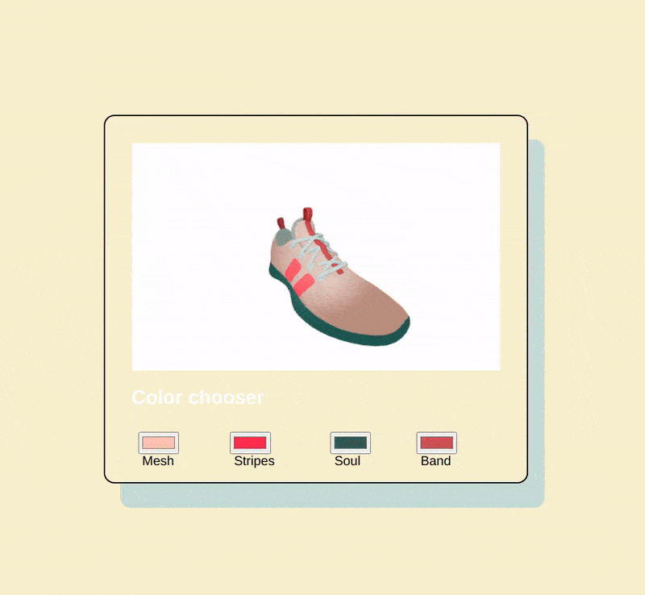

### Product Configurator with react-three-fiber 🌈

 

> Product configuration is the process of customizing a product to meet the needs of a customer. A product configuration tool is usually included as a part of CPQ software and allows customers and sales reps to configure products themselves.

 
 

### What we will be doing in this tutorial:

 

- How to use React.js with react-three-fiber to render and manipulate 3d models

- How to interactively change properties of the 3d model

- How to work with GLTF file formats in React

 

 
 

### Articles

[Building a 3D Product Configurator with Nuxt and Three.js (Part 1)](https://official-osorina.medium.com/creating-a-3d-configurator-with-nuxt-and-three-js-part-1-6d40da0209e0)

 

### Video examples

[3D model configurator with React Three Fiber and gltfjsx](https://www.youtube.com/watch?v=xy_tbV4pC54)

[Working with GLTF models in React.js: Build a product customizer with react-three-fiber](https://www.youtube.com/watch?v=2jwqotdQmdQ&list=PLIQopnnM5nVatnVa0YZZFGG1EDaSpJ2tn&index=480)

### Credits

#### [ ui-code-tv](https://youtu.be/2jwqotdQmdQ)

 
 
